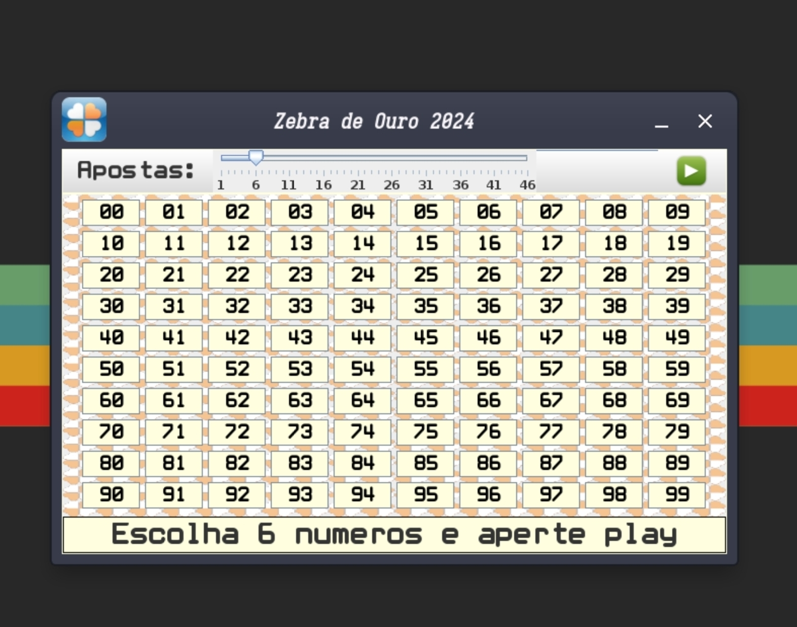
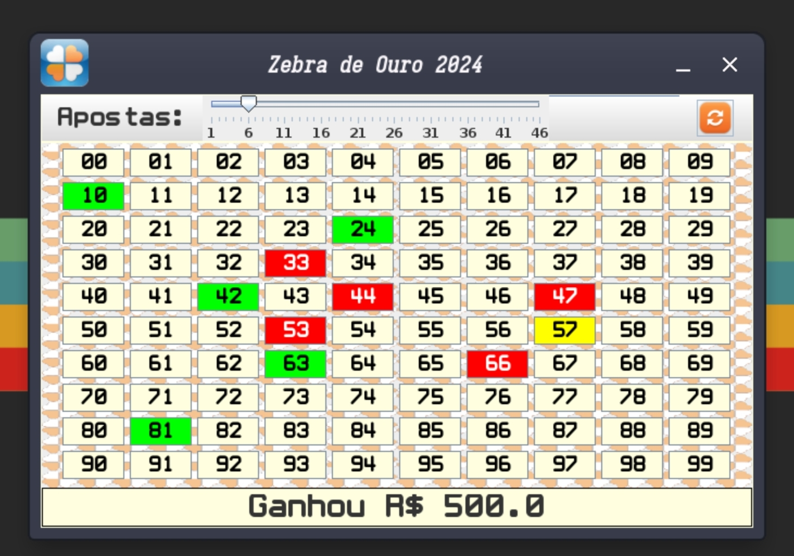

# Loto Fácil



## Proposta

LotoFacil é um programa que simula um sorteio de loteria
você pode escolher quantos números quiser e testar sua sorte.

## Instalação

### Observação 
Este programa foi escrito para ser usado em um ambiente linux, no entanto seu código fonte
se encontra na pasta *src* para outros formatos de compilação.


### Instalação Linux

Ao adentrar a pasta do projeto dígite:

``` bash
    # 1° passo:
    make
    # 2° passo:
    make run
    # Caso queira gerar um arquivo .jar:
    make jar
```

Após Esta etapa o programa inicia sua execução, escolha seus números e aposte:



#### caso queira alterar uma casa selecionada é so clicar nela novamente.

## Caso deseje alterar o números de casas selecionadas, altere o slider:


